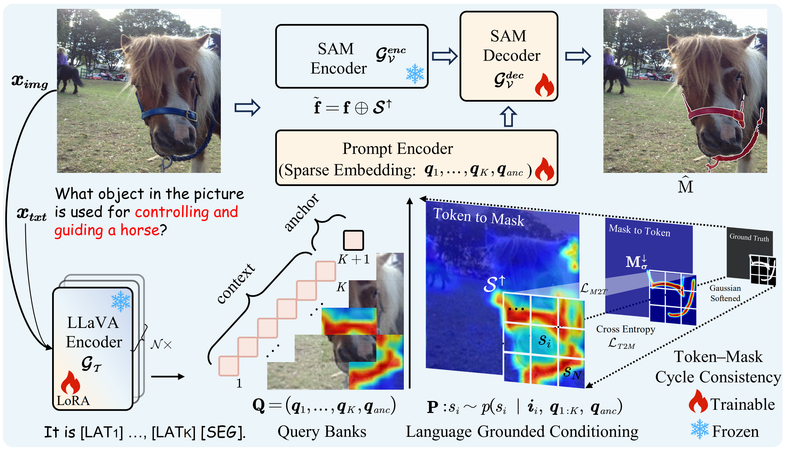
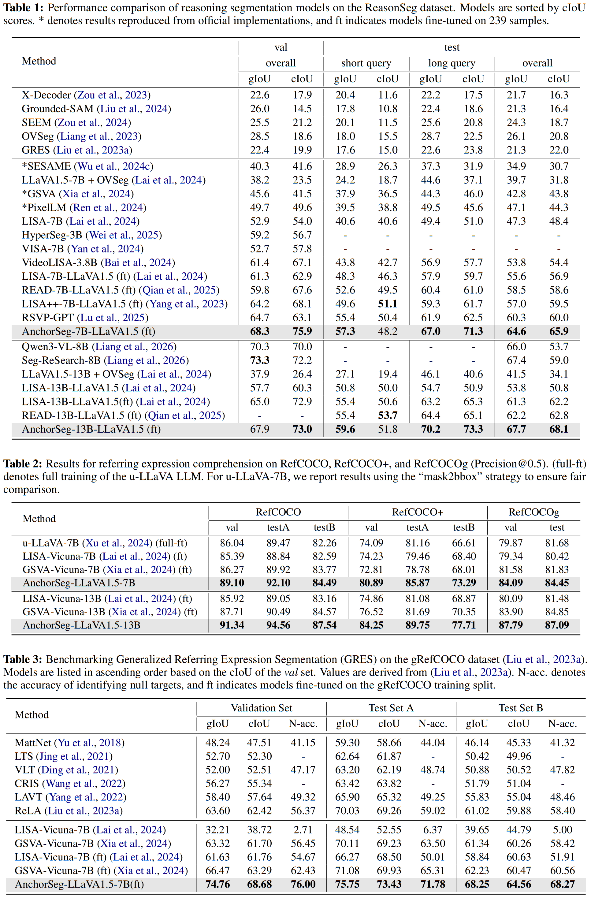

# AnchorSeg: Language Grounded Query Banks for Reasoning Segmentation (ACL 2026)

[](https://lbesson.mit-license.org/)  [](https://arxiv.org/pdf/2604.18562) 


**Authors**: 
[Rui Qian](https://scholar.google.com.hk/citations?user=z3sAW3oAAAAJ&hl=zh-CN), 
[Chuanhang Deng](https://scholar.google.com/citations?hl=zh-CN&user=xUxVwu0AAAAJ), 
[Qiang Huang](https://scholar.google.com/citations?user=1fPw-s4AAAAJ),
[Jian Xiong](https://scholar.google.com.hk/citations?hl=zh-CN&user=ePOXfkAAAAAJ),
[Mingxuan Li](https://scholar.google.com.hk/citations?hl=zh-CN&user=pkD6cVkAAAAJ),
[Yingbo Zhou](https://scholar.google.com.hk/citations?hl=zh-CN&user=1hEiYYcAAAAJ),
[Wei Zhai](https://scholar.google.com.hk/citations?hl=zh-CN&user=seIo-acAAAAJ),
[Jintao Chen](https://scholar.google.com.hk/citations?hl=zh-CN&user=MWTZAK4AAAAJ),
[Dejing Dou†](https://scholar.google.com.hk/citations?hl=zh-CN&user=qBHsQ04AAAAJ). 


## Abstract
Reasoning segmentation requires models to ground complex, implicit textual queries into precise pixel-level masks. Existing approaches 
rely on a single segmentation token <SEG>, whose hidden state implicitly encodes both semantic reasoning and spatial localization, limiting the model's ability to explicitly disentangle *what to segment* from *where to segment*. We introduce AnchorSeg, which reformulates reasoning segmentation as a structured conditional generation process over image tokens, conditioned on language grounded query banks. Instead of compressing both semantic reasoning and spatial localization into a single embedding, AnchorSeg constructs an ordered sequence of query banks: latent reasoning tokens that capture intermediate semantic states, and a segmentation anchor token that provides explicit spatial grounding. We model spatial conditioning as a factorized distribution over image tokens, where the anchor query determines localization signals while contextual queries provide semantic modulation. To bridge token-level predictions and pixel-level supervision, we propose Token--Mask Cycle Consistency (TMCC), a bidirectional training objective that enforces alignment across resolutions. By explicitly decoupling spatial grounding from semantic reasoning through structured language grounded query banks, AnchorSeg achieves state-of-the-art results on ReasonSeg test set 
(67.7% gIoU and 68.1% cIoU). All code and models are publicly available at https://github.com/rui-qian/AnchorSeg.
<p align="center">  </p>

## News
- [x] [2026.4.7] AnchorSeg has been accepted to ACL 2026🎉🎉🎉! 
- [x] [2026.8.12] AnchorSeg code and [AnchorSeg-LLaVA-v1.5-7B](https://huggingface.co/rui-qian/hf-AnchorSeg-7b_reason_seg_val_llava1.5_ema) models are released. Welcome to check them out!
- [x] [2026.4.18] [Paper](https://arxiv.org/pdf/2604.18562) is released and GitHub repo is created.

## 🔥 Visual Grounding Family

<details open><summary>Language to Grounding in vision and Beyond: </summary><p>


> [**UGround: Towards Unified Visual Grounding with Unrolled Transformers (ICML 2026)**](http://arxiv.org/abs/2510.03853) <br>
> **Authors:** Rui Qian, Xin Yin, Chuanhang Deng, Zhiyuan Peng, Jian Xiong, Wei Zhai, Dejing Dou <br>
[](https://github.com/rui-qian/UGround) [](https://github.com/rui-qian/UGround) [](http://arxiv.org/abs/2510.03853) [](https://huggingface.co/rui-qian) [](https://icml.cc/media/PosterPDFs/ICML%202026/65753.png?t=1781773589.6352596)


 > [**AnchorSeg: Language Grounded Query Banks for Reasoning Segmentation (ACL 2026)**](https://arxiv.org/abs/2604.18562) <br>
> **Authors:** Rui Qian, Chuanhang Deng, Qiang Huang, Jian Xiong, Mingxuan Li, Yingbo Zhou, Wei Zhai, Jintao Chen, Dejing Dou <br>
[](https://github.com/rui-qian/AnchorSeg) [](https://github.com/rui-qian/AnchorSeg) [](https://arxiv.org/abs/2604.18562) [](https://huggingface.co/rui-qian) [](https://paperform.co/file/s3.amazonaws.com/pf-user-files-01/u-59356/uploads/2026-06-05/wpg33nu/ACL%202026_main-2262.pdf?t=1746173344.963275) [](https://paperform.co/file/s3.amazonaws.com/pf-user-files-01/u-59356/uploads/2026-06-05/28733p2/ACL%202026_main-2262.mp4) [](https://huggingface.co/datasets/rui-qian/misc/blob/main/ACL%202026_main-2262.pptx.pptx)

> [**Reasoning to Attend: Try to Understand How <SEG> Token Works (CVPR 2025)**](https://arxiv.org/abs/2412.17741) <br>
> **Authors:** Rui Qian, Xin Yin, Dejing Dou <br>
[](https://github.com/rui-qian/READ) [](https://github.com/rui-qian/READ) [](https://arxiv.org/abs/2412.17741) [](https://huggingface.co/papers/2412.17741) [](https://cvpr.thecvf.com/media/PosterPDFs/CVPR%202025/32873.png?t=1746173344.9632757)
</p></details>


## Installation Guide

```bash=
#!/bin/bash
# 1. curl -O https://repo.anaconda.com/archive/Anaconda3-2025.06-0-Linux-x86_64.sh
# 2. bash Anaconda3-2025.06-0-Linux-x86_64.sh
# 3. conda create -n uground python=3.9
# 4. conda activate uground
# 5. chmod +x build.sh 
# 6. ./build.sh
# 7. wget https://github.com/Dao-AILab/flash-attention/releases/download/v2.6.3/flash_attn-2.6.3+cu118torch2.0cxx11abiFALSE-cp39-cp39-linux_x86_64.whl
# 8. pip install flash_attn-2.6.3+cu118torch2.0cxx11abiFALSE-cp39-cp39-linux_x86_64.whl
# 9. chmod +x install.sh
#10. ./install.sh
```

For ease of installation, we have encapsulated the setup steps into a script, [*build.sh*](./build.sh). You can complete the environment configuration within 5 minutes.

## Model and Dataset Preparation

Currently, we support 8 dataset types, namely:
A: **sem_seg**, B: **refer_seg**, C: **neg_refer_seg**, D: **correct_refer_seg**, E: **vqa**, F: **reason_seg**, G: **reason_seg_plus**, and H: **multi_reason_seg**. Please Visit [UGround dataset page](./dataloaders/README.md) for more details.

A: **sem_seg**: ade20k||cocostuff||pascal_part||paco_lvis||mapillary

B: **refer_seg**: refclef||refcoco||refcoco+||refcocog||[refzom](https://github.com/toggle1995/RIS-DMMI)||[grefcoco](https://github.com/henghuiding/gRefCOCO)

C: **neg_refer_seg**: R-refcoco||R-refcoco+||R-refcocog

D: **correct_refer_seg**: [fprefcoco||fprefcoco+||fprefcocog](https://github.com/see-say-segment/sesame)

E: **vqa**: llava_instruct_150k

F: **reason_seg**: ReasonSeg|train

G: **reason_seg_plus**(LISA++): [instance_seg||cot||conversations||caption](https://huggingface.co/collections/Senqiao/lisa-67713837a32d6abf516a162e)

H: **multi_reason_seg**(muse): [MultiReasonSeg|train](https://github.com/MaverickRen/PixelLM)

| Model Name | gIoU      cIoU | Snapshot | HG-ckpt URL
|----------------------------|----------------|----------------|----------------|
Results on ReasonSeg
| [AnchorSeg-LLaVA-v1.5-7B_ema/val](https://huggingface.co/rui-qian/hf-AnchorSeg-7b_reason_seg_val_llava1.5_ema/tree/main)  |67.20 75.15 |  [archive](https://huggingface.co/rui-qian/hf-AnchorSeg-7b_reason_seg_val_llava1.5_ema/blob/main/AnchorSeg-7b_llava1.5_ema_ReasonSeg.png) | [weights](https://huggingface.co/rui-qian/hf-AnchorSeg-7b_reason_seg_val_llava1.5_ema/tree/main) 
Results on gReferSeg
| [AnchorSeg-LLaVA-v1.5-7B](https://huggingface.co/rui-qian/hf-AnchorSeg-7b_grefer_seg_llava1.5_ema/tree/main)  |74.76 68.68 |  [archive](https://huggingface.co/rui-qian/hf-AnchorSeg-7b_grefer_seg_llava1.5_ema/blob/main/AnchorSeg-7b_llava1.5_ema_grefcoco.png) | [weights](https://huggingface.co/rui-qian/hf-AnchorSeg-7b_grefer_seg_llava1.5_ema/tree/main) 


## Experimental results 

<p align="left">  </p>

## Training

```bash= #
./scripts/7b_reason_seg_val/train_anchorseg_llava1.5_ema.sh     # for ReasonSeg 7B
./scripts/13b_reason_seg_val/train_anchorseg_llava1.5_ema.sh    # for ReasonSeg 13B
```
## Merge LoRA Weight

```bash= #
./scripts/7b_reason_seg_val/merge_lora_weight_uground_llava1.5_ema.sh     # for ReasonSeg 7B
./scripts/13b_reason_seg_val/merge_lora_weight_uground_llava1.5_ema.sh    # for ReasonSeg 13B
```

## Validation

```bash= #
./scripts/7b_reason_seg_val/eval_anchorseg_llava1.5_ema.sh     # for ReasonSeg 7B
./scripts/13b_reason_seg_val/eval_anchorseg_llava1.5_ema.sh    # for ReasonSeg 13B
```

## Acknowledgements

We are grateful for the foundational code provided by [PixelLM](https://github.com/MaverickRen/PixelLM), [SESAME](https://github.com/see-say-segment/sesame), [GSVA](https://github.com/LeapLabTHU/GSVA), [READ](https://github.com/rui-qian/READ), [LISA](https://github.com/dvlab-research/LISA), [LLaVA](https://github.com/haotian-liu/LLaVA), and [SAM](https://github.com/facebookresearch/segment-anything). Utilizing their resources implies agreement to their respective licenses. Our project benefits greatly from these contributions, and we acknowledge their significant impact on our work.

## Citation

If you use our work or our implementation in this repo, or find them helpful, please consider giving a citation.
```
@inproceedings{qian2026UGround,
  title={UGround: Towards Unified Visual Grounding with Unrolled Transformers},
  author={Qian, Rui and Yin, Xin and Deng, Chuanhang and Peng, Zhiyuan and Xiong, Jian and Zhai, Wei and Dou, Dejing},
  booktitle={International Conference on Machine Learning},
  year={2026}
}
@inproceedings{qian2026AnchorSeg,
  title={AnchorSeg: Language Grounded Query Banks for Reasoning Segmentation},
  author={Qian, Rui and Deng, Chuanhang and Huang, Qiang and Xiong, Jian and Li, Mingxuan and Zhou, Yingbo and Zhai, Wei and Chen, Jintao and Dou, Dejing},
  booktitle={Annual Meeting of the Association for Computational Linguistics},
  year={2026}
}
@inproceedings{qian2025reasoning,
  title={Reasoning to Attend: Try to Understand How <SEG> Token Works},
  author={Qian, Rui and Yin, Xin and Dou, Dejing},
  booktitle={Proceedings of the Computer Vision and Pattern Recognition Conference},
  year={2025}
}
```
## Contact
If you have any questions, feel free to reach out at qiianruii@gmail.com, dengch2000@gmail.com, and dejingdou@gmail.com.
